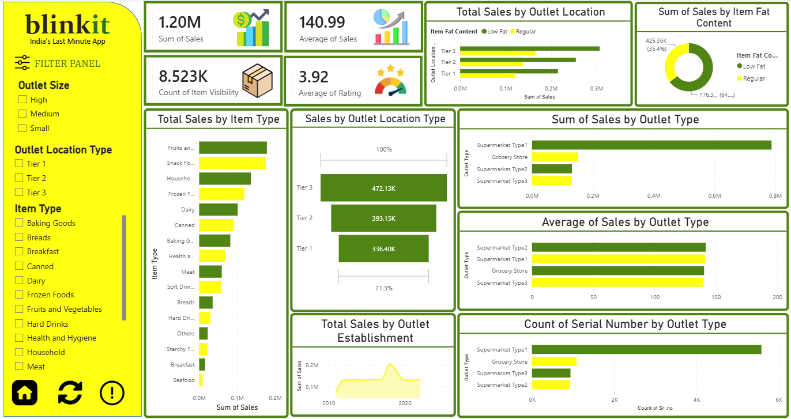
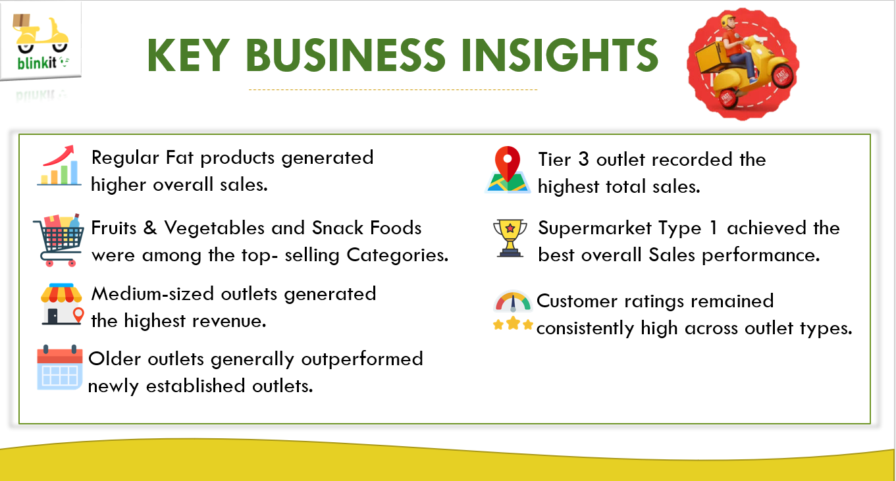

# 🛒 BlinkIT Data Analysis

An end-to-end retail data analytics project built using **Python, SQL, Microsoft Excel, and Power BI** to analyze BlinkIT's sales performance, customer ratings, inventory distribution, and outlet performance. This project demonstrates the complete data analytics workflow—from data cleaning and SQL analysis to interactive dashboard development and business insight generation.

---

# 📖 Project Overview

The BlinkIT Data Analysis project focuses on transforming raw retail sales data into actionable business insights. Using Python, SQL, Excel, and Power BI, the project analyzes customer purchasing behavior, outlet performance, inventory distribution, and sales trends to support data-driven decision-making.

---

# 🎯 Business Objectives

- Analyze overall sales performance.
- Evaluate customer satisfaction using ratings.
- Identify top-performing product categories.
- Compare sales across outlet locations and outlet sizes.
- Analyze sales based on fat content and item types.
- Measure outlet performance using key business metrics.
- Build an interactive Power BI dashboard for business reporting.

---

# 🛠️ Tech Stack

| Technology | Purpose |
|------------|---------|
| Python | Data Cleaning & Exploratory Data Analysis |
| SQL (MySQL) | Data Analysis & KPI Calculation |
| Microsoft Excel | Data Preparation & Validation |
| Power BI | Dashboard Development & Visualization |

---

# 📂 Project Workflow

```text
Raw Dataset
      │
      ▼
Data Cleaning (Python & Excel)
      │
      ▼
Exploratory Data Analysis
      │
      ▼
SQL Analysis
      │
      ▼
Power BI Dashboard
      │
      ▼
Business Insights
```

---

# 📊 Key Performance Indicators (KPIs)

- 💰 Total Sales
- 📈 Average Sales
- 📦 Number of Items Sold
- ⭐ Average Customer Rating

---

# 📈 Dashboard Analysis

The dashboard provides interactive insights into:

- Total Sales by Fat Content
- Total Sales by Item Type
- Fat Content Analysis by Outlet
- Sales by Outlet Establishment Year
- Percentage of Sales by Outlet Size
- Sales by Outlet Location
- Sales by Outlet Type
- Interactive KPI Cards
- Dynamic Filters & Slicers

---

# 🐍 Python Analysis

Python was used for:

- Data Cleaning
- Missing Value Handling
- Data Preprocessing
- Exploratory Data Analysis (EDA)
- Data Validation
- Preparing data for SQL and Power BI

### Libraries Used

- Pandas
- NumPy
- Matplotlib

---

# 🗄️ SQL Analysis

SQL was used to perform:

- Data Exploration
- Aggregate Functions
- GROUP BY Analysis
- CASE Statements
- Sales Analysis
- Average Rating Analysis
- Outlet-wise Performance Analysis
- Item Type Analysis
- KPI Calculation
- Ranking & Sorting

---

# 📊 Excel Analysis

Excel was used for:

- Data Cleaning
- Removing Duplicates
- Data Formatting
- Data Validation
- Dataset Preparation

---

# 📈 Power BI Dashboard

The Power BI dashboard includes:

- KPI Cards
- Bar Charts
- Donut Charts
- Line Charts
- Matrix Tables
- Interactive Slicers
- Business KPI Visualization

---

# 📷 Dashboard Preview



---

# 📌 Key Business Insights

The dashboard highlights valuable business insights, including:

- Regular Fat products generated the highest sales revenue.
- Fruits & Vegetables and Snack Foods were the top-performing product categories.
- Medium-sized outlets contributed the highest share of total sales.
- Tier 3 outlet locations recorded the maximum revenue.
- Supermarket Type 1 outperformed all other outlet types.
- Customer ratings remained consistently high across all outlet categories.
- Older outlets generally achieved stronger sales performance than newly established outlets.

### Business Insights Visualization



---

# 💡 Skills Demonstrated

- Data Cleaning
- Data Wrangling
- Exploratory Data Analysis (EDA)
- SQL Query Writing
- Data Visualization
- KPI Development
- Dashboard Design
- Business Intelligence
- Retail Sales Analytics
- Reporting & Analytics
- Problem Solving

---

# 📁 Repository Structure

```text
BlinkIT-Data-Analysis/
│
├── 📁 Business Requirements/
│
├── 📊 BLINKIT Data Analysis Dashboard in PowerBI.pbix
├── 📈 Blinkit Data Analysis in Excel.xlsx
├── 🗄️ Blinkit Data Analysis in SQL.sql
├── 🐍 Blinkit_Analysis_in_Python.ipynb
├── 🖼️ Power BI Dashboard_Screenshot.png
├── 📊 Key_Business_Insights.png
└── 📄 README.md
```

---

# 🚀 Future Enhancements

- Sales Forecasting using Machine Learning
- Customer Segmentation Analysis
- Automated ETL Pipeline
- Real-Time Dashboard Integration
- Cloud Database Connectivity
- Advanced Predictive Analytics

---

# 📚 Learning Outcomes

This project provided hands-on experience in:

- End-to-End Data Analytics
- Retail Sales Analysis
- Data Cleaning & Transformation
- SQL Query Optimization
- KPI Development
- Interactive Dashboard Design
- Business Intelligence
- Data Storytelling

---

# 👩‍💻 Author

## Greeshma R Krishnan

Aspiring Data Analyst | Python | SQL | Excel | Power BI | Machine Learning

- 📧 Email: your-krishnangreeshmar30@gmail.com
- 💼 GitHub: https://github.com/greeshmakrishnan00
- 🔗 LinkedIn:https://www.linkedin.com/in/greeshma-r-krishnan-1706a438a/

---
